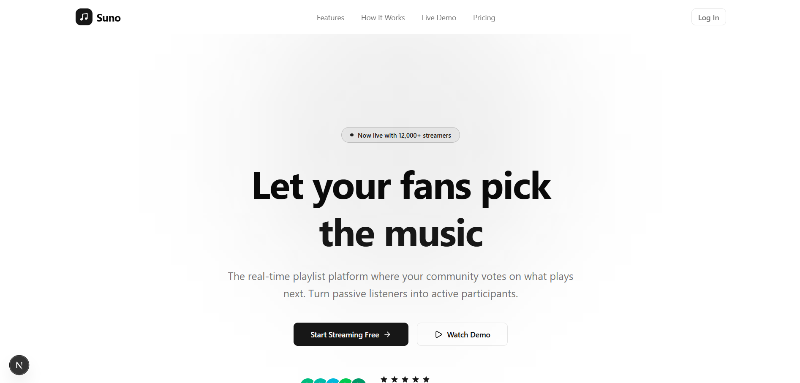
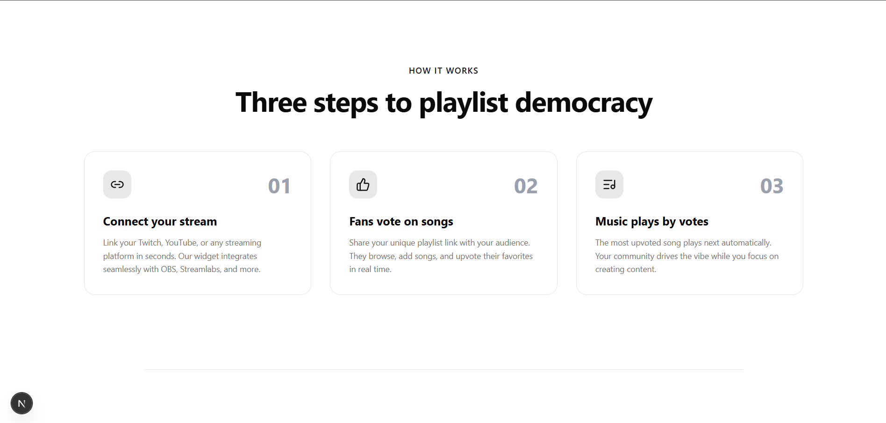
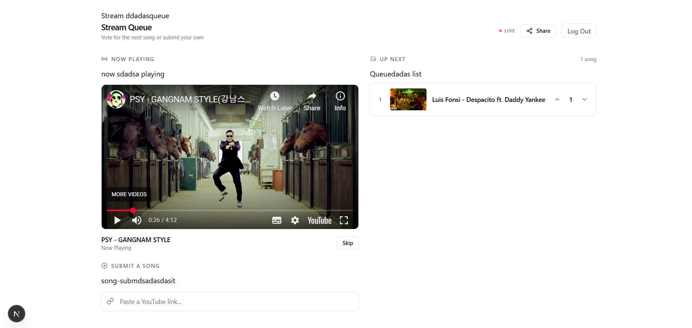

(Still in production)

# 🎵 Suno

**Suno** is a music & media SaaS platform that lets **streamers and creators** hand control to their audience — allowing fans to **vote on what music or video plays next** during live streams or sessions.

Think: interactive queues, real-time engagement, and fans feeling *heard*.

---

## 🚀 What is Suno?

Suno helps creators:
- Increase **live engagement**
- Let fans **vote on songs or videos**
- Play the **most-voted media automatically**
- Turn passive viewers into active participants

Perfect for:
- 🎮 Streamers  
- 🎥 Content creators  
- 🎧 DJs / Music streamers  
- 🎤 Live events & watch parties  

---

## ✨ Core Features

- 🗳️ **Fan Voting System**  
  Fans vote in real time on songs or videos.

- 📊 **Live Media Queue**  
  Media is ordered dynamically based on votes.

- 🎶 **Music & Video Support**  
  Supports different types of media (songs, videos, clips).

- 🔒 **Creator-Controlled Sessions**  
  Only creators control when voting opens/closes.

- ⚡ **Real-Time Updates**  
  Votes and queue update instantly.

---

## 🖼️ UI Preview

Screenshots of the UI are available in the `/images` folder.

Example usage in markdown:





```md
